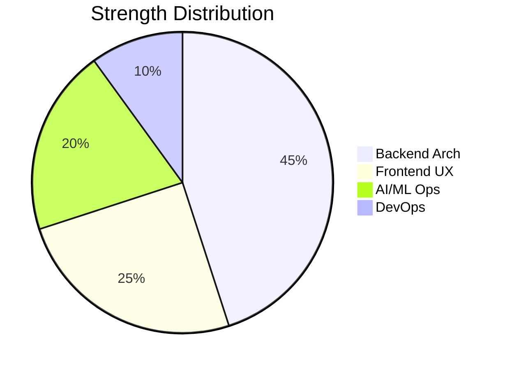
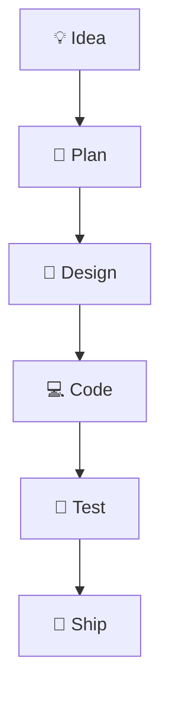

<div align="center">


<p align="center">
    <a href="https://drive.google.com/file/d/1jspxlxYZPGKAYRdut__0VwtkpQnUoNfx/view?usp=sharing" target="_blank">
        
    </a>
    <a href="#" target="_blank">
        
    </a>
    <a href="#" target="_blank">
        
    </a>
</p>

[](https://github.com/Sarthak-Shreshtha01)
[](https://github.com/Sarthak-Shreshtha01?tab=followers)
[](https://github.com/Sarthak-Shreshtha01)

</div>

---

## 👨‍💻 About Me

```ts
const sarthak = {
  role: "Full-Stack Developer & Backend Architect",
  location: "India 🇮🇳",
  education: "B.Tech CSE @ Birla Institute of Technology, Mesra (CGPA: 8.4/10)",
  currentlyBuilding: "Production APIs & event-driven backends at Quickeee",
  expertise: ["Next.js", "NestJS", "Prisma", "Redis/BullMQ", "AI Integrations"],
  focusAreas: ["API Development", "Distributed Systems", "Event-Driven Architecture"],
  workingOn: [
    "AI-powered SaaS platforms",
    "Real-time data pipelines",
    "Cloud-native backend systems"
  ],
  philosophy: "Code with purpose. Build with passion. Deploy with precision."
};
```

I am a full-stack engineer who builds scalable, production-ready web applications with modern technologies. From crafting high-performance UIs using **Next.js & Tailwind** to architecting robust, event-driven backends with **NestJS, Prisma & Redis/BullMQ**, I thrive on solving real problems with clean code.

### 🌙 Nightly Stats

```plaintext
☕ Coffee Consumed: ███████░░░ 70%
👾 Bugs Crushed:   ████████░░ 80%
💻 Code Quality:   ██████████ 100%
💤 Sleep Cycle:    ██░░░░░░░░ 20%
```

---

## 🎓 Education

| Institution | Duration | Detail |
|---|---|---|
| **Birla Institute of Technology, Mesra** — B.Tech, Computer Science & Engineering | 2023 – 2027 | CGPA: 8.4/10 |
| **Delhi Public School, Bokaro** — CBSE Class XII | 2021 – 2023 | 92% |

---

## 💼 Experience

### 🟦 Software Developer Intern — **Quickeee Pvt Ltd**
*May 2026 – Jul 2026*
- Reduced order sync latency by **99.9%** (120s → <5ms) by architecting Redis Pub/Sub wake signals with priority-tiered BullMQ workers, eliminating polling overhead.
- Engineered an automated nightly **inventory reconciliation pipeline** (BullMQ + Redis + cron) for Unicommerce sync, with a manual-trigger override API.
- Developed and shipped **30+ REST APIs** across Purchase Orders, Inventory, Refunds, and Warehouse Operations; built SKU search and Redis cache-invalidation layers.
- Implemented the end-to-end warehouse fulfillment flow (**PO → GRN → Putaway → Picklist → Manifest**) and debugged webhook delivery across 4 order types (prepaid, COD, try-and-buy, returns).

### 🟪 Full Stack Developer — **Productimate AI Solutions**
*May 2025 – Jan 2026*
- Developed cross-platform production features using **Next.js, React Native, Node.js, and PostgreSQL** across multiple B2B SaaS applications.
- Engineered **PhonePe subscription billing**, role-based access control (RBAC), AI-powered email generation, and CSV lead-import pipelines.
- Integrated **AWS S3, CloudWatch, GA4 analytics, and Hygraph CMS**; improved Core Web Vitals through SSR optimization and lazy loading.

---

## ⚔️ Skills Matrix

<table align="center">
  <tr>
    <td align="center" width="96">
      
      <br>Frontend
    </td>
    <td align="center" width="96">
      
      <br>Backend
    </td>
    <td align="center" width="96">
      
      <br>Database
    </td>
    <td align="center" width="96">
      
      <br>DevOps
    </td>
    <td align="center" width="96">
      
      <br>Cloud
    </td>
  </tr>
  <tr>
    <td colspan="5" align="center">
      <br>
      
      <br><br>
      
      <br><br>
      
      <br><br>
      
      <br>
    </td>
  </tr>
</table>

---

## 📡 Tech Radar & Workflow

<table border="0" width="100%">
  <tr>
    <td width="50%" valign="top">

### 🎯 Engineering Focus


```mermaid
pie title Strength Distribution
    "Backend Arch" : 45
    "Frontend UX" : 25
    "AI/ML Ops" : 20
    "DevOps" : 10
```

</td>
    <td width="50%" valign="top">

### 🧠 My Development Process


```mermaid
graph TD;
  Idea[💡 Idea] --> Plan[📝 Plan];
  Plan --> Design[📐 Design];
  Design --> Code[💻 Code];
  Code --> Test[🧪 Test];
  Test --> Deploy[🚀 Ship];
```

</td>
  </tr>
</table>

---

## 🚀 Featured Projects

<table border="0">
  <tr>
    <td width="50%" valign="top">

<h3 align="center">📈 TradeX — Unified Investment Dashboard</h3>

<div align="center">
  
</div>
<br>
<p>
Real-time portfolio dashboard integrating 3 brokerage APIs (Zerodha, AngelOne, Upstox) via persistent WebSockets, tracking 200+ instruments with sub-100ms query/update latency. Includes a Gemini-powered AI recommendation engine that cut manual research time by 40%.
</p>

<p align="center">
  
  
  
</p>

<div align="center">
  <a href="#">View Demo</a> • <a href="#">Source Code</a>
</div>

</td>
    <td width="50%" valign="top">

<h3 align="center">🎪 Pantheon'25 — BIT Mesra Technical Fest</h3>

<div align="center">
  
</div>
<br>
<p>
Official technical fest website with GSAP-driven scroll animations, SSG rendering, and technical SEO — achieving a 100% Lighthouse SEO score and sub-2s LCP on mobile. Sustained 10,000+ concurrent participants at peak with zero downtime via CDN deployment.
</p>

<p align="center">
  
  
  
</p>

<div align="center">
  <a href="#">View Demo</a> • <a href="#">Source Code</a>
</div>

</td>
  </tr>
  <tr>
    <td width="50%" valign="top">

<h3 align="center">🌟 Starsec Landing Page</h3>

<div align="center">
  
</div>
<br>
<p>
A high-performance production landing page built for a security SaaS. Features complex GSAP animations and structured SEO metadata.
</p>

<p align="center">
  
  
  
</p>

<div align="center">
  <a href="#">View Demo</a> • <a href="#">Source Code</a>
</div>

</td>
    <td width="50%" valign="top">

<h3 align="center">🚢 Shipyard AI Platform</h3>

<div align="center">
  
</div>
<br>
<p>
AI-based image generation SaaS integrating OpenAI and Claude. Features a credit system, secure API rate-limiting, and cloud storage.
</p>

<p align="center">
  
  
  
</p>

<div align="center">
  <a href="#">View Demo</a> • <a href="#">Source Code</a>
</div>

</td>
  </tr>
</table>

---

## 🏗️ TradeX — System Architecture


```mermaid
flowchart LR
    User[👤 User] --> Client[🖥️ Next.js Client]
    Client -- WebSocket --> Gateway[🛡️ WS Gateway]
    Gateway --> Server[⚙️ Node.js Server]
    Server --> Brokers[📊 Zerodha / AngelOne / Upstox]
    Server --> AI[🤖 Google Gemini]
    Server --> DB[(🐘 PostgreSQL)]
    Brokers --> Gateway
    AI --> Client
    style Client fill:#0d1117,stroke:#A9FEF7
    style Server fill:#0d1117,stroke:#A9FEF7
    style AI fill:#0d1117,stroke:#F7DF1E
```

## 🏗️ Shipyard AI — System Architecture


```mermaid
flowchart LR
    User[👤 User] --> Client[🖥️ Next.js Client]
    Client --> API[🛡️ API Gateway]
    API --> Server[⚙️ Node.js Server]
    Server --> Auth[🔐 Clerk Auth]
    Server --> DB[(🐘 PostgreSQL)]
    Server --> AI[🤖 OpenAI/Gemini]
    AI --> Storage[☁️ AWS S3]
    Storage --> Client
    style Client fill:#0d1117,stroke:#A9FEF7
    style Server fill:#0d1117,stroke:#A9FEF7
    style AI fill:#0d1117,stroke:#F7DF1E
```

---

## 🏆 Achievements

- 🥉 **4th Place — Hackfest'25** (IIT ISM Dhanbad); awarded a Pre-Placement Interview (PPI) from HF ILNB Financial Services.
- 🥈 **1st Runner-up — Hackatron'25** (BIT Sindri).
- 🎤 **General Secretary, Dhwani Music Society**, BIT Mesra.
- 🇩🇪 **Goethe-Institut German A1** Certified.

---

## 📊 GitHub Statistics

<div align="center">
  
  
</div>
<br>
<div align="center">
  
</div>

---

<div align="center">
  <picture>
    <source media="(prefers-color-scheme: dark)" srcset="https://raw.githubusercontent.com/Sarthak-Shreshtha01/Sarthak-Shreshtha01/output/github-contribution-grid-snake-dark.svg">
    <source media="(prefers-color-scheme: light)" srcset="https://raw.githubusercontent.com/Sarthak-Shreshtha01/Sarthak-Shreshtha01/output/github-contribution-grid-snake.svg">
    
  </picture>
</div>

---

<div align="center">

<h3>📫 Let's Connect</h3>

<a href="https://www.linkedin.com/in/sarthak-shreshtha/"></a>
<a href="mailto:sarthakshreshtha345@gmail.com"></a>
<a href="https://leetcode.com/u/sarthakshreshtha345/"></a>
<a href="https://www.sarthakshreshtha.dev/"></a>

<br><br>


<p>Thanks for visiting! Let's build something amazing together 🚀</p>

</div>
