<div align="center">


<p align="center">
    <a href="YOUR_RESUME_LINK_HERE" target="_blank">
        
    </a>
</p>

[](https://github.com/Sarthak-Shreshtha01)
[](https://github.com/Sarthak-Shreshtha01?tab=followers)
[](https://github.com/Sarthak-Shreshtha01)

</div>

---

## 👨‍💻 About Me

```ts
const sarthak = {
  role: "Full-Stack Developer & Backend Architect",
  location: "India 🇮🇳",
  education: "BTech CSE Student",
  expertise: ["Next.js", "Prisma", "AI Integrations", "Cloud Deployments"],
  focusAreas: ["API Development", "AI Automation", "Microservices"],
  workingOn: [
    "AI-powered SaaS platforms",
    "Modern landing pages",
    "Cloud-native backend systems"
  ],
  philosophy: "Code with purpose. Build with passion. Deploy with precision."
};
```

I am a full-stack engineer who builds scalable, production-ready web applications with modern technologies. From crafting high-performance UIs using **Next.js & Tailwind** to architecting robust backends with **Prisma & Node.js**, I thrive on solving real problems with clean code.

### 🌙 Nightly Stats

```plaintext
☕ Coffee Consumed: ███████░░░ 70%
👾 Bugs Crushed:   ████████░░ 80%
💻 Code Quality:   ██████████ 100%
💤 Sleep Cycle:    ██░░░░░░░░ 20%
```

---

## ⚔️ Skills Matrix

<table align="center">
  <tr>
    <td align="center" width="96">
      
      <br>Frontend
    </td>
    <td align="center" width="96">
      
      <br>Backend
    </td>
    <td align="center" width="96">
      
      <br>Database
    </td>
    <td align="center" width="96">
      
      <br>DevOps
    </td>
    <td align="center" width="96">
      
      <br>Design
    </td>
  </tr>
  <tr>
    <td colspan="5" align="center">
      <br>
      
      <br><br>
      
      <br><br>
      
      <br><br>
      
      <br>
    </td>
  </tr>
</table>

---

## 📡 Tech Radar & Workflow

<table border="0" width="100%">
  <tr>
    <td width="50%" valign="top">

### 🎯 Engineering Focus


</td>
    <td width="50%" valign="top">

### 🧠 My Development Process

```mermaid
graph TD;
  Idea[💡 Idea] --> Plan[📝 Plan];
  Plan --> Design[📐 Design];
  Design --> Code[💻 Code];
  Code --> Test[🧪 Test];
  Test --> Deploy[🚀 Ship];
```



</td>
  </tr>
</table>

---

## 🚀 Featured Projects

<table border="0">
  <tr>
    <td width="50%" valign="top">

<h3 align="center">🌟 Starsec Landing Page</h3>

<div align="center">
  
</div>
<br>
<p>
A high-performance production landing page built for security SaaS. Features complex GSAP animations and structured SEO metadata.
</p>

<p align="center">
  
  
  
</p>

<div align="center">
  <a href="#">View Demo</a> • <a href="#">Source Code</a>
</div>

</td>
    <td width="50%" valign="top">

<h3 align="center">🚢 Shipyard AI Platform</h3>

<div align="center">
  
</div>
<br>
<p>
AI-Based Image Generation SaaS integrating OpenAI and Claude. Features a credit system, secure API rate-limiting, and cloud storage.
</p>

<p align="center">
  
  
  
</p>

<div align="center">
  <a href="#">View Demo</a> • <a href="#">Source Code</a>
</div>

</td>
  </tr>
</table>

---

## 🏗️ Shipyard AI — System Architecture

```mermaid
flowchart LR
    User[👤 User] --> Client[🖥️ Next.js Client]
    Client --> API[🛡️ API Gateway]
    API --> Server[⚙️ Node.js Server]
    Server --> Auth[🔐 Clerk Auth]
    Server --> DB[(🐘 PostgreSQL)]
    Server --> AI[🤖 OpenAI/Gemini]
    AI --> Storage[☁️ AWS S3]
    Storage --> Client
    style Client fill:#0d1117,stroke:#A9FEF7
    style Server fill:#0d1117,stroke:#A9FEF7
    style AI fill:#0d1117,stroke:#F7DF1E
```



---

## ⚙️ Automating This Month

<div align="left">
  <code>Last Updated: December 2025</code>
</div>
<br>

⏳ Reduced API response time by **40%** via Redis caching implementation.

🤖 Auto-deployed CI pipeline for backend microservices using **GitHub Actions**.

🧹 Cleaned PR workflow by enforcing semantic commits with **Husky**.

🔄 Implemented auto-scaling for the image-generation message queue.

---

## 📊 GitHub Statistics

<div align="center">
  
  
</div>
<br>
<div align="center">
  
</div>

---

<div align="center">
  <picture>
    <source media="(prefers-color-scheme: dark)" srcset="https://raw.githubusercontent.com/Sarthak-Shreshtha01/Sarthak-Shreshtha01/output/github-contribution-grid-snake-dark.svg">
    <source media="(prefers-color-scheme: light)" srcset="https://raw.githubusercontent.com/Sarthak-Shreshtha01/Sarthak-Shreshtha01/output/github-contribution-grid-snake.svg">
    
  </picture>
</div>

---

<div align="center">

<h3>📫 Let's Connect</h3>

<a href="https://linkedin.com/in/YOUR_USERNAME"></a>
<a href="mailto:YOUR_EMAIL"></a>
<a href="https://twitter.com/YOUR_USERNAME"></a>

<br><br>


<p>Thanks for visiting! Let's build something amazing together 🚀</p>

</div>
